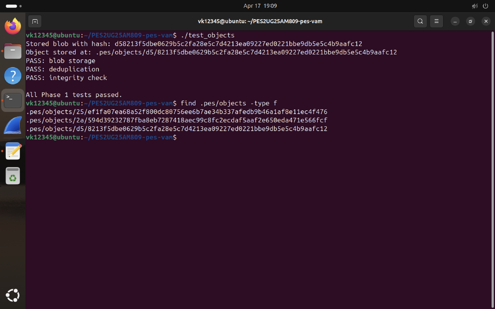
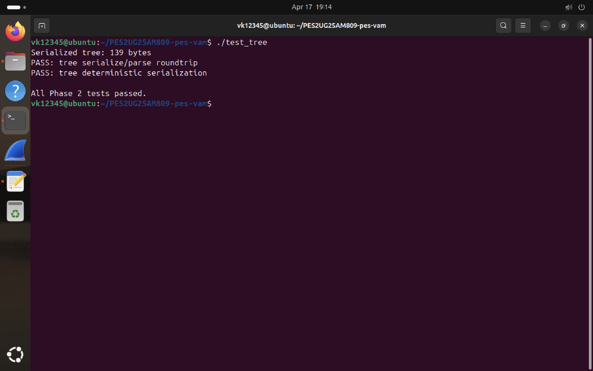
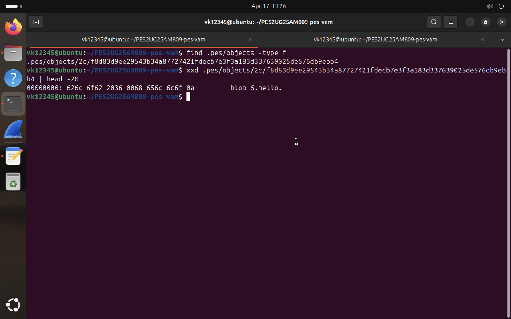
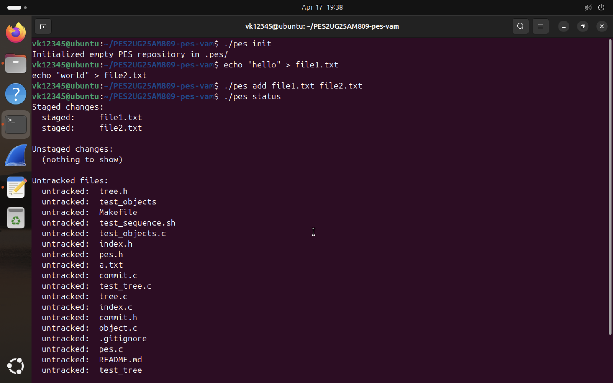
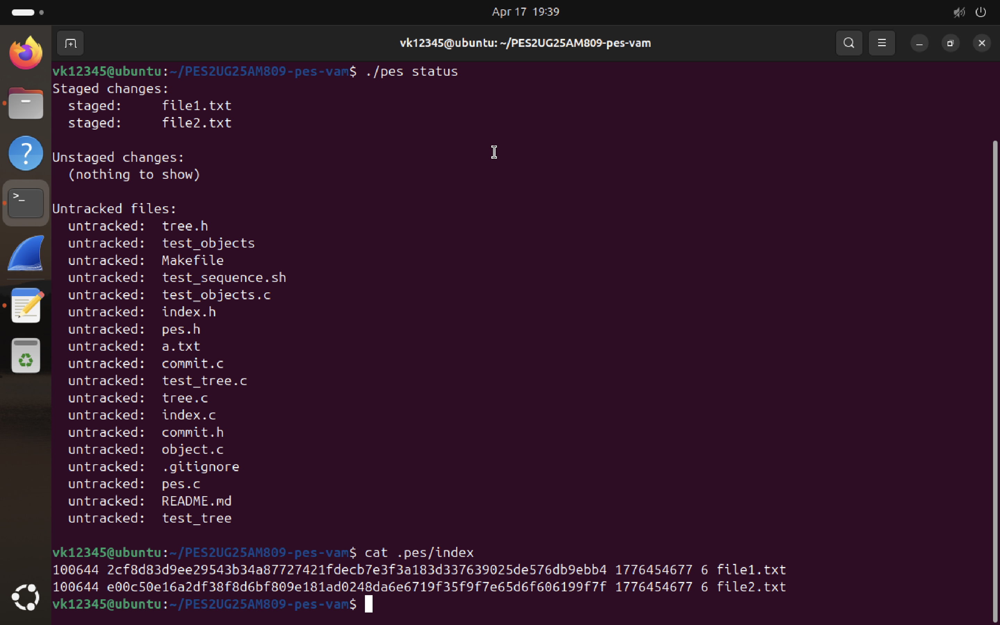
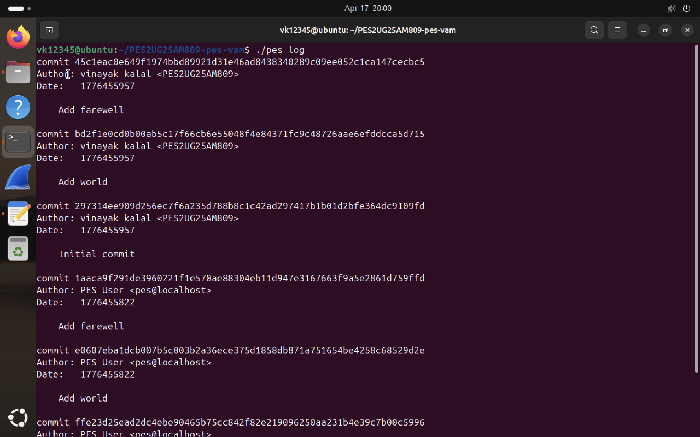
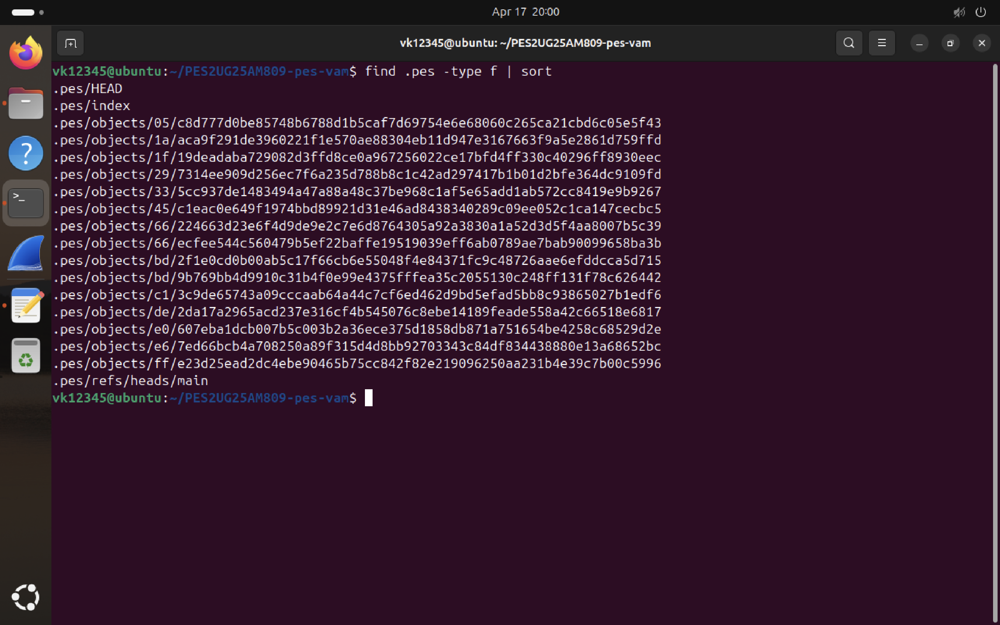
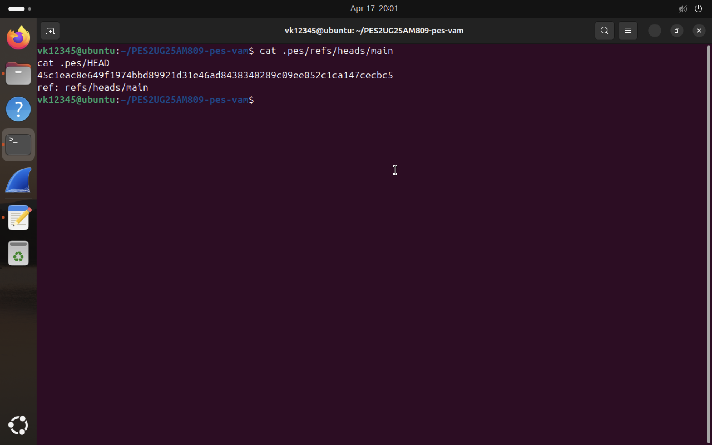
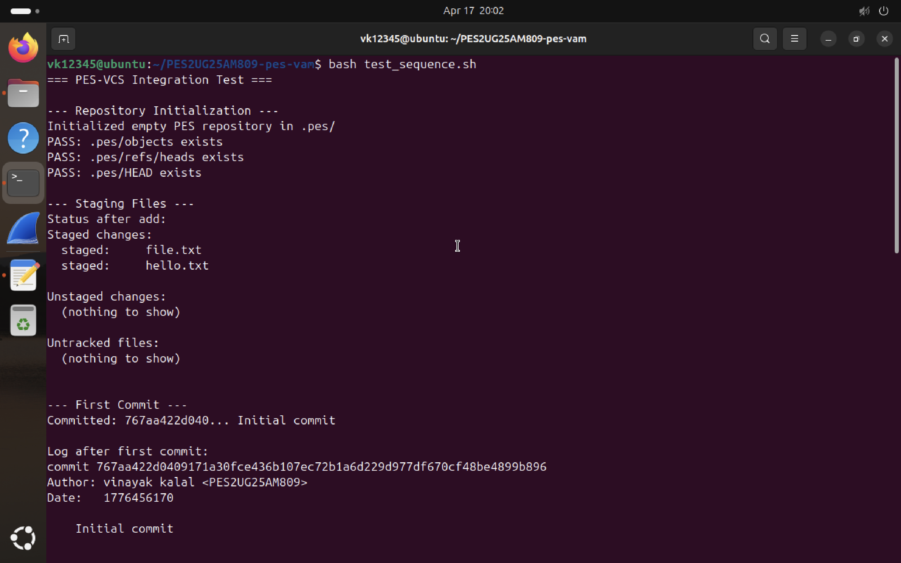
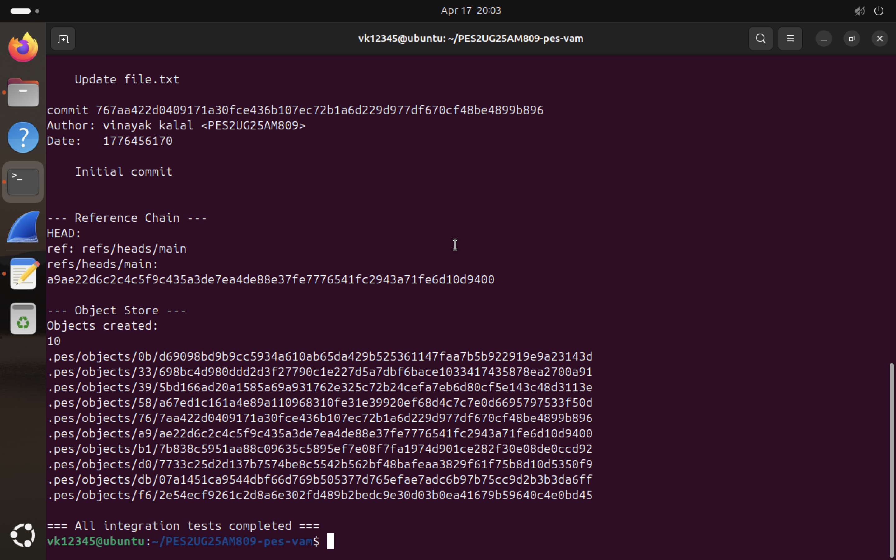

# PES Version Control System (PES-VCS)

## Name: vinayak kalal

## SRN: PES2UG25AM809  

## Phase 1

## Phase 2

## Phase 3

## Phase 4

## Integration Test

Q 5.1

The object store uses SHA-256 hashing to uniquely identify data. 
Each object is stored using its hash, ensuring that identical content 
is stored only once (deduplication). This provides integrity and 
efficient storage.

Q 5.2

Atomic writes ensure that the index file is either fully written or 
not written at all. This is achieved by writing to a temporary file 
and renaming it. It prevents corruption in case of crashes.

Q 5.3

Trees represent directory structures by storing file names, modes, 
and object hashes. They enable hierarchical organization of files 
and allow commits to reference a snapshot of the project.

Q 6.1

Commits store metadata such as author, timestamp, and parent commit. 
They also store the root tree hash. This allows tracking of project 
history and enables features like log traversal.

Q 6.2

The HEAD pointer tracks the latest commit in the current branch. 
It is updated after each commit. Branches store commit hashes and 
allow navigation through project history
